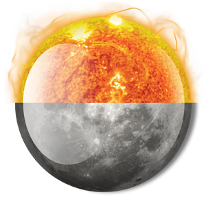

# PNG size corruption checker

Simple python program which checks PNG file's size in IHDR is correct.

Inspired from CTF problem.

## Usage

    $ python checker.py <image file name>

## Example

    $ python checker.py sample/sunmoon.png
    [*] Height in IHDR: 0x12b
    [*] Real Height: 0x12b
    [+] Size matches

    $ python checker.py sample/sunmoon_wrong_size.png
    [*] Height in the IHDR: 0x8b
    [*] Real Height: 0x12b
    [!!] Wrong size in the IHDR
    Automatically fix the IHDR? (Y/N)Y
    [*] Fixed file saved to sample/sunmoon_wrong_size_fixed.png

## Description

 

These two PNG images above have same IDAT chunk data.

The only difference between two images is the height value in IHDR (and the CRC value).

Which means, by manipulating the height value in IHDR, one can hide extra data ( or maybe a malicious code ) from PNG image.

Therefore, this program checks whether the height value in IHDR is uncorrupted, by directly calculating height of the image from IDAT section.

### Requirements

- Python3

### References

> https://www.w3.org/TR/PNG/

> http://halicery.com/Image/png/pngdecoding.html

> http://www.libpng.org/pub/png/spec/1.2/PNG-Chunks.html
